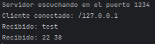

# Tarea de servidores

## Índice
- [Tarea 1](#1)
- [Tarea 2](#2)
- [Tarea 3](#3)
- [Tarea 4](#4)
- [Tarea 5](#5)

### 1.- Servidor Simple 
Crea un programa de servidor que escuche en un puerto específico y un cliente que se conecte a este servidor. El cliente enviará un mensaje al servidor, y el servidor le responderá con el mismo mensaje.

Cliente   

Servidor:   

### 2.- Servidor con Conversacion Continua 
Extiende (ServidorContinua extend Servidor) el ejercicio anterior para que el cliente y el servidor puedan mantener una conversación continua. El cliente podrá enviar varios mensajes al servidor, y el servidor devolverá cada mensaje hasta que el cliente envíe el mensaje "salir", lo cual cerrará la conexión.

Cliente

Servidor:

### 3.- Servidor de Suma de Numeros 
Diseña un servidor que reciba dos números enteros de un cliente, los sume y devuelva el resultado. El cliente deberá enviar los dos números separados por un espacio. Por ejemplo, si envía 5 7, el servidor deberá responder 12.

Cliente

Servidor:

### 4.- Servidor Multicliente de Chat en Línea 
Implementa un servidor de chat donde múltiples clientes puedan conectarse y chatear entre ellos. El servidor debe reenviar cada mensaje que reciba a todos los clientes conectados.

Gestionar múltiples conexiones simultáneas con Thread y enviar datos a varios clientes.

Clientes:

- 1   

- 2   
  

- 3   
  

Servidor:

### 5.- Servidor de Archivos con Transferencia de Datos Binaria 
Crea un servidor que permita a un cliente solicitar un archivo especificando su nombre. El servidor debe buscar el archivo en su directorio local y, si lo encuentra, enviarlo al cliente. El cliente debe guardar el archivo recibido en su sistema y mostrar un mensaje con el contenido del fichero y cuando lo ha recibido.

